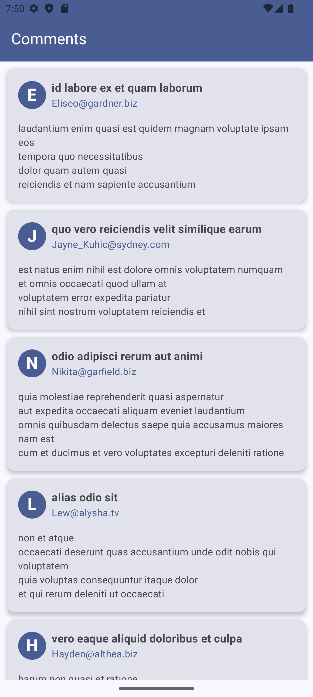

# KtorInAction
A simple app showcasing how [Ktor](https://ktor.io/docs/welcome.html) can be leveraged for Network calls. In this project, we build a nice **Comments App**, that fetches [data](https://jsonplaceholder.typicode.com/comments) from a free API Faker **"{JSON} Placeholder"**. 
## What is Ktor?
A lightweight and flexible framework for building asynchronous client and server-side applications in Kotlin
## Why Ktor? 
- **Kotlin and Coroutines** - Ktor is built from the ground up using Kotlin and Coroutines, as such it is provides a "Kotlin-first" approach and support for asynchronous tasks. 
- **Lightweight and flexible** - Ktor allows you to only use what you need and to structure your application the way you need. 
- **Built and backed by JetBrains** - the very creator of Kotlin, IntelliJ IDEA and more 
- **Multiplatform support** - Ktor is a multiplatform library, allowing you to share network code between different platforms (Android, iOS, JVM, JS, Native).

# Let's Build 👷‍♂️⚒️🪛
While getting data from the internet using **Ktor** is the primary focus for this project, we will use other libraries including
- Koin - for dependency injection
- Kotlinx-serialization - core library for serializing and deserializing Kotlin objects
- kotlinx-serialization-json - provides JSON Format specific support . For entity serialization
- Kotlinx-coroutines 
- Content-negotiation - needed for Ktor http requests and kotlinx-seialization to work together seamlessly 
- lifecycle 
- Logback - a logging framework that enables logging for Ktor
 
## Step 1: Add Dependencies and Plugins 
### We use versions Catalog
- Add the following in ```libs.versions.toml``` file 
```toml
[versions]
# ... Rest of the code
kotlin = "2.0.0"
ktor = "2.3.12"
kotlinx-serialization = "2.0.0"
kotlinx-serialization-json = "1.7.1"
logbackClassic = "1.3.12" 
lifecycle = "2.8.4"
koin = "3.5.6"
koinCompose = "3.4.6"
kotlinxCoroutines = "1.9.0-RC"
```
```toml
[libraries]
# ... Rest of the code
ktor-client-core = { module = "io.ktor:ktor-client-core", version.ref = "ktor" } # core engine. Not necessary
ktor-client-android = { module = "io.ktor:ktor-client-android", version.ref = "ktor"} # engine that handles network requests on Android
kotlinx-serialization-json = { module = "org.jetbrains.kotlinx:kotlinx-serialization-json", version.ref = "kotlinx-serialization-json"}
ktor-client-content-negotiation = { module = "io.ktor:ktor-client-content-negotiation", version.ref = "ktor" }
ktor-serialization-kotlinx-json = { module = "io.ktor:ktor-serialization-kotlinx-json", version.ref = "ktor" }
ktor-client-logging = {module = "io.ktor:ktor-client-logging", version.ref = "ktor"}
logback-classic = { module = "ch.qos.logback:logback-classic", version.ref = "logbackClassic" }
lifecycle-viewmodel-compose = { module = "androidx.lifecycle:lifecycle-viewmodel-compose", version.ref = "lifecycle" }
compose-lifecycle = { module = "androidx.lifecycle:lifecycle-runtime-compose", version.ref = "lifecycle"}
#dependency injection
koin-core = { module ="io.insert-koin:koin-core", version.ref = "koin"}
koin-android = { module = "io.insert-koin:koin-android", version.ref = "koin"}
koin-androidx-compose = { module = "io.insert-koin:koin-androidx-compose", version.ref = "koinCompose"}
```
```toml
[Plugins]
# ... Rest of the code
kotlinxSerialization = { id = "org.jetbrains.kotlin.plugin.serialization", version.ref = "kotlinx-serialization" }
compose-compiler = { id = "org.jetbrains.kotlin.plugin.compose", version.ref = "kotlin" }
```
```toml
# Note: Bundles help us provide related dependencies all at once.
[bundles]
koin = ["koin-core", "koin-android", "koin-androidx-compose"]
ktor = ["ktor-client-core", "ktor-client-android", "kotlinx-serialization-json", "ktor-client-content-negotiation",
    "ktor-serialization-kotlinx-json","ktor-client-logging", "logback-classic"]
coroutines = ["kotlinx-coroutines-core", "kotlinx-coroutines-android"]
```
- Add the following in ```build.gradle.kts``` project-level file
```agsl
plugins {
    // ... Rest of the code
    alias(libs.plugins.kotlinxSerialization) apply false
    alias(libs.plugins.compose.compiler) apply false
}
```
- Add the following in ```build.gradle.kts``` app-level file
```kotlin
plugins {
    // ... Rest of the code
    alias(libs.plugins.kotlinxSerialization)
    alias(libs.plugins.compose.compiler)
}

dependencies {
    // ... Rest of the code
    implementation(libs.bundles.ktor)
    implementation(libs.lifecycle.viewmodel.compose)
    implementation(libs.compose.lifecycle)
    implementation(libs.bundles.koin)
    implementation(libs.bundles.coroutines)
}
```
- Be sure to ```sync``` your project after adding dependencies. 
While at it you're likely to run into an ```issue``` like this one here⬇️
#### Possible Issues❗
> x files found with path 'META-INF/INDEX.LIST' . Adding a packaging block may help, please refer to https://developer.android.com/reference/tools/gradle-api/8.5/com/android/build/api/dsl/Packaging for more information

#### Solution
- Add the line ```excludes +="META-INF/INDEX.LIST"``` to the packaging block in your ```build.gradle.kts``` app-level file

```kotlin
android {
    // ... Rest of the code
    packaging {
        resources {
            excludes += "/META-INF/{AL2.0,LGPL2.1}"
            excludes +="META-INF/INDEX.LIST" // Add this line
        }
    }
}
```
## Step 2: Define your entity class
Now you need an entity class to hold your data. For our demo project we are getting ``comments`` data from a free API Faker ```{JSON} Placeholder```. Here is the endpoint: https://jsonplaceholder.typicode.com/comments
Our model class will be as follows. Create it in a package called ``models``

```kotlin
@Serializable
data class Comment(
    val body: String,
    val email: String,
    val id: Int,
    val name: String,
    val postId: Int
)
```
Notice the @Serializable annotation - it helps us serialize our entity object and represnt it in other formats such as ``JSON``

## Step 3: Set up Your API Service 
- Create a package called ``network``. Inside it, create a file called ``CommentsAPIService.kt`` 
- You need a ``http client`` for your API service to help you get data from the internet. Inside your ``CommentsAPIService.kt`` file create an instance of the client like this 
```kotlin
val httpClient = HttpClient {
    install(ContentNegotiation) {
        json(
            Json {
                prettyPrint = true
                isLenient = true
                ignoreUnknownKeys = true
            }
        )
    }
    install(Logging){
        logger = Logger.DEFAULT
        level = LogLevel.HEADERS
    }
}

```
- Notice we are configuring our client to use ``ContentNegotiation`` and ``Logging``. More ``configurations`` can be done but for brevity we will keep these two. 
Now we need an ``APIService``. Inside ``CommentsAPIService.kt``, below the ``http client`` create an API Service class as follows 
```kotlin
class CommentsAPIService {

    suspend fun getComments(): List<Comment> {
        return httpClient
            .get("https://jsonplaceholder.typicode.com/comments")
            .body<List<Comment>>()
    }
}

```
- Note: We configured our client to use ``Logging``. Since we are using ``Logback`` we complete the ``configuration`` by creating an ``xml`` file. In your ``src/main/resources`` directory, create a ``logback.xml`` file to configure ``Logback`` as follows:-
```xml
<?xml version="1.0" encoding="utf-8"?>
<configuration>
    <appender name="CONSOLE" class="ch.qos.logback.core.ConsoleAppender">
        <encoder>
            <pattern>%d{HH:mm:ss.SSS} [%thread] %-5level %logger{36} - %msg%n</pattern>
        </encoder>
    </appender>

    <root level="DEBUG">
        <appender-ref ref="CONSOLE" />
    </root>
</configuration>
```
## Step 4: Set up Your Repository
- We use the ``Repository pattern`` to keep things clean and organized. Besides, the ``repository pattern`` helps to abstract the data access layer, providing a clean separation between the application's business logic and how it interacts with data sources. 
- First, we need a custom ``NetworkResult`` generic sealed class to hold the network responses.  Create the sealed ``NetworkResult`` class inside the network package 

```kotlin
sealed class NetworkResult<out T> {
    data class Success<out T>(val data: T) : NetworkResult<T>()
    data class Error(val message: String) : NetworkResult<Nothing>()
}
```

- Now Create a ``repository`` package, inside the package create the ``repository interface`` and the ``implementation class`` as follows 
```kotlin
interface CommentRepository {
    suspend fun getComments(): NetworkResult<List<Comment>>
}

class CommentRepositoryImpl(
    private val apiService: CommentsAPIService,
    private val dispatcher: CoroutineDispatcher
): CommentRepository {

    override suspend fun getComments(): NetworkResult<List<Comment>> {
        return withContext(dispatcher){
            try{
                val response = apiService.getComments()
                NetworkResult.Success(response)
            }catch (e: Exception){
                NetworkResult.Error(e.message ?: "Something went wrong")
            }
        }
    }
}
```
- We parse an ``apiService`` to help us get data and the ``coroutineDispatcher`` to help us with switching tasks to background threads.

## Step 5: Prepare ViewModel
- Create a new package ``viewmodel``
- Inside create a file named ``CommentsViewModel`` with this code 
```kotlin
data class CommentsUIState(
    val comments: List<Comment> = emptyList(),
    val error: String? = null,
    val isLoading: Boolean = false
)

class CommentsViewModel(
    private val repository: CommentRepository
): ViewModel() {

    private val _commentsUIState = MutableStateFlow(CommentsUIState())
    val commentsUIState: StateFlow<CommentsUIState> = _commentsUIState.asStateFlow()

    init {
        getComments()
    }

    private fun getComments(){

        _commentsUIState.value = _commentsUIState.value.copy(isLoading = true, comments = emptyList())

        viewModelScope.launch {
            val result = repository.getComments()
            when(result){

                is NetworkResult.Success -> {
                    _commentsUIState.update {
                        it.copy(
                            comments = result.data,
                            isLoading = false,
                        )
                    }
                }

                is NetworkResult.Error -> {
                    _commentsUIState.update {
                        it.copy(
                            isLoading = false,
                            error = result.message
                        )
                    }
                }
            }
        }
    }
}
```
Notice we used flows and UIState. 

## Step 6: Set up dependency injection with koin 
- Create a new package called ``di``. Inside create a new file ``AppModules`` and declare your dependencies as follows 

```kotlin
val appModules = module {
    //API Service dependency
    single <CommentsAPIService> { CommentsAPIService() }
    //coroutine dispatcher dependency
    single { Dispatchers.IO }

    //repository dependency
    single <CommentRepository>{
        CommentRepositoryImpl(
            apiService = get(),
            dispatcher = get()
        )
    }
    //viewmodel dependency
    single { CommentsViewModel(repository = get()) }

}
```
- Next, create an ``Application`` class that extends the ``Application class``. We start ``Koin`` from this class 

```kotlin
import android.app.Application
import org.koin.android.ext.koin.androidContext
import org.koin.core.context.startKoin

class KtorInActionApplication: Application() {
    override fun onCreate() {
        super.onCreate()
        startKoin {
            androidContext(this@KtorInActionApplication)
            modules(appModules)
        }

    }
}
```

## Step 7: Modify the ``AndroidManifest.xml`` file
- Next, in the manifest file, add the Application class inside the application tags 
- ALso, explicitly declare your network permissions. Without this your app wont be able to get data from the internet.
```xml
<?xml version="1.0" encoding="utf-8"?>
<manifest xmlns:android="http://schemas.android.com/apk/res/android"
    xmlns:tools="http://schemas.android.com/tools">

    <!--You need to explittly include permisssions for internet-->
    <uses-permission android:name="android.permission.INTERNET"/>
    <uses-permission android:name="android.permission.ACCESS_NETWORK_STATE"/>

<application
    android:name=".KtorInActionApplication" 

    <!-- Rest of the code -->
 >
 
<!-- Rest of the code -->

</application>
```

## Step 8: Prepare your UI
- Now, we need the UI from where we will be displaying our comments. Here, we display specific UI for different UIStates as shown in the code below. 

> Notice we use viewModel from ``koinViewModel`` – since we have ``dependency injection`` set up already with ``koin``
```kotlin
import androidx.compose.animation.AnimatedVisibility
import androidx.compose.foundation.background
import androidx.compose.foundation.layout.Arrangement
import androidx.compose.foundation.layout.Box
import androidx.compose.foundation.layout.Column
import androidx.compose.foundation.layout.Row
import androidx.compose.foundation.layout.Spacer
import androidx.compose.foundation.layout.fillMaxSize
import androidx.compose.foundation.layout.fillMaxWidth
import androidx.compose.foundation.layout.padding
import androidx.compose.foundation.layout.size
import androidx.compose.foundation.layout.width
import androidx.compose.foundation.lazy.LazyColumn
import androidx.compose.foundation.lazy.items
import androidx.compose.foundation.shape.CircleShape
import androidx.compose.material.icons.Icons
import androidx.compose.material.icons.filled.Warning
import androidx.compose.material3.Card
import androidx.compose.material3.CardDefaults
import androidx.compose.material3.CircularProgressIndicator
import androidx.compose.material3.ExperimentalMaterial3Api
import androidx.compose.material3.Icon
import androidx.compose.material3.MaterialTheme
import androidx.compose.material3.Scaffold
import androidx.compose.material3.Text
import androidx.compose.material3.TopAppBar
import androidx.compose.material3.TopAppBarDefaults
import androidx.compose.runtime.Composable
import androidx.compose.runtime.getValue
import androidx.compose.ui.Alignment
import androidx.compose.ui.Modifier
import androidx.compose.ui.draw.clip
import androidx.compose.ui.graphics.Color
import androidx.compose.ui.text.font.FontWeight
import androidx.compose.ui.unit.dp
import androidx.compose.ui.unit.sp
import androidx.lifecycle.compose.collectAsStateWithLifecycle
import com.samueljuma.ktorinaction.model.Comment
import com.samueljuma.ktorinaction.viewmodel.CommentsViewModel
import org.koin.androidx.compose.koinViewModel

@OptIn(ExperimentalMaterial3Api::class)
@Composable
fun CommentsListScreen() {

    val viewModel: CommentsViewModel = koinViewModel()
    val commentsUIState by viewModel.commentsUIState.collectAsStateWithLifecycle()

    Scaffold(
        topBar = {
            TopAppBar(
                title = { Text(text = "Comments") },
                colors = TopAppBarDefaults.topAppBarColors(
                    containerColor = MaterialTheme.colorScheme.primary,
                    titleContentColor = MaterialTheme.colorScheme.onPrimary,
                )
            )
        },
        content = { paddingValues ->
            Column(
                Modifier
                    .fillMaxSize()
                    .padding(paddingValues),
                horizontalAlignment = Alignment.CenterHorizontally,
                verticalArrangement = Arrangement.Center
            ) {
                AnimatedVisibility(visible = commentsUIState.comments.isNotEmpty()) {
                    LazyColumn {
                        items(items = commentsUIState.comments) { comment ->
                            CommentItem(comment = comment)
                        }
                    }
                }

                AnimatedVisibility(visible = commentsUIState.isLoading) {
                    CircularProgressIndicator()
                }

                AnimatedVisibility(visible = commentsUIState.error != null) {
                    Column(
                        modifier = Modifier
                            .fillMaxSize()
                            .padding(16.dp),
                        horizontalAlignment = Alignment.CenterHorizontally,
                        verticalArrangement = Arrangement.Center
                    ) {
                        Icon(
                            imageVector = Icons.Default.Warning,
                            contentDescription = "Error",
                            tint = Color.Red,
                            modifier = Modifier
                                .size(60.dp)
                                .padding(bottom = 10.dp)
                        )
                        Text(
                            text = "There Was An Error! Try Again...",
                            color = Color.Red,
                            fontSize = 24.sp
                        )
                    }
                }
            }
        }
    )
}


@Composable
fun CommentItem(comment: Comment) {
    Card(
        modifier = Modifier
            .padding(top = 10.dp, start = 10.dp, end = 10.dp)
            .fillMaxWidth(),
        elevation = CardDefaults.cardElevation(4.dp)
    ) {
        Column(
            modifier = Modifier
                .padding(16.dp)
        ) {
            Row(
                verticalAlignment = Alignment.CenterVertically,
                modifier = Modifier.padding(bottom = 8.dp)
            ) {
                Box(
                    modifier = Modifier
                        .size(40.dp)
                        .clip(CircleShape)
                        .background(MaterialTheme.colorScheme.primary),
                    contentAlignment = Alignment.Center
                ) {
                    Text(
                        text = comment.email.first().uppercaseChar().toString(),
                        color = MaterialTheme.colorScheme.onPrimary,
                        fontWeight = FontWeight.Bold,
                        fontSize = 24.sp
                    )
                }
                Spacer(modifier = Modifier.width(8.dp))
                Column {
                    Text(
                        text = comment.name,
                        style = MaterialTheme.typography.titleMedium,
                        fontWeight = FontWeight.Bold
                    )
                    Text(
                        text = comment.email,
                        style = MaterialTheme.typography.bodyMedium,
                        color = MaterialTheme.colorScheme.primary
                    )
                }
            }
            Text(
                text = comment.body,
                style = MaterialTheme.typography.bodyMedium,
                modifier = Modifier.padding(top = 8.dp)
            )
        }
    }
}
```
## Step 9: Run the Project. 
- At this point, all we need to run the project and see what we have created
- You should get a nice Comments App like this one here
#### Screenshots

[//]: # (|     |   |  |  |)

[//]: # (|:---------------------------------:|:-------------------------------:|:------------------------------:|:------------------------------:|)


